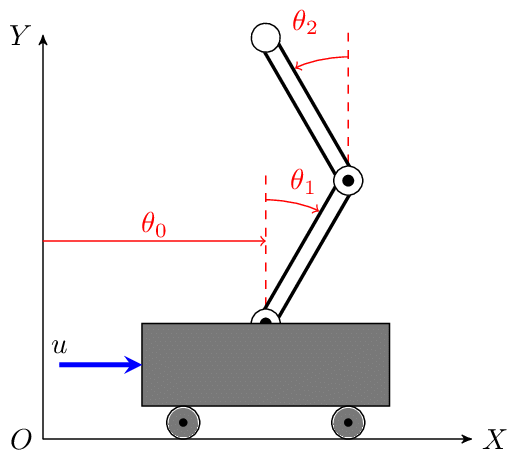

# Inverted Pendulum Control on a Mobile Cart

  

This repository includes three subprojects focused on the control of inverted pendulums mounted on a mobile cart with friction. Each configuration increases in complexity, covering from a single pendulum to a double pendulum system using various control strategies.

---

## 📁 Subprojects

### 1. **Simple Inverted Pendulum**

This project addresses the control of a **simple inverted pendulum** mounted on a cart subject to friction \( b \). The system is **nonlinear and unstable** at its upright equilibrium point. A force \( u \) can be applied to the cart to balance the pendulum.

- **State variables**:
  - \( x(t) \): cart position
  - \( \theta(t) \): pendulum angle relative to vertical
- **Parameters**:
  - Cart mass \( M \)
  - Pendulum mass \( m \)
  - Pendulum length \( L \)

---

### 2. **Simple Inverted Pendulum with Adaptive Control (MRAC)**

This version implements a **Model Reference Adaptive Control (MRAC)** strategy to improve robustness against parameter uncertainty. The structure is similar to the simple case, but the controller adapts its behavior in real time.

- Adapts to unknown or changing values of \( M \), \( m \), \( L \), or \( b \)
- Maintains stability even under modeling errors

---

### 3. **Double Inverted Pendulum**

This is the most challenging scenario: a **double inverted pendulum on a mobile cart**. The system is **highly nonlinear, chaotic, and unstable**. The goal is to design a controller that balances both pendulums in their upright positions.

- **State variables**:
  - \( x(t) \): cart position
  - \( \theta_1(t) \): angle of the first pendulum
  - \( \theta_2(t) \): angle of the second pendulum
- **Parameters**:
  - Cart mass \( M \)
  - Pendulum masses \( m \)
  - Length \( L \)
  - Friction \( b \)
---

## 📫 Contact

David Redondo Quintero  
davidredquin@gmail.com
